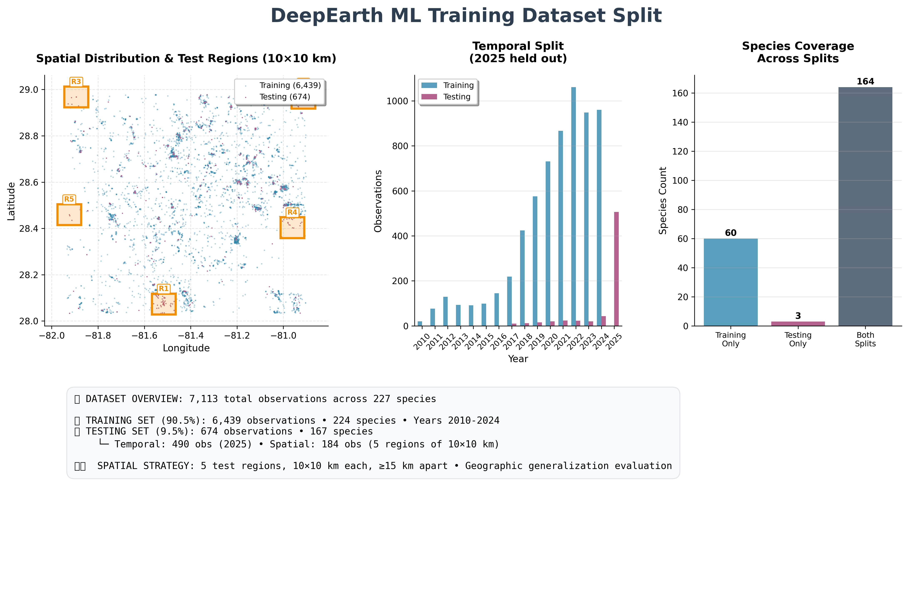
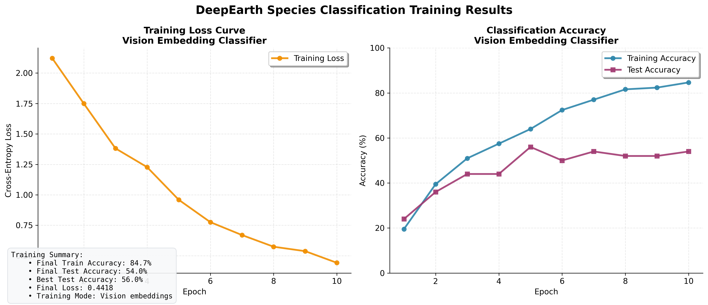

# DeepEarth ML Training System

**Multimodal Training Infrastructure for Biodiversity Research**


## Overview

The DeepEarth Training System provides foundational infrastructure and reference implementations for machine learning research on multimodal biodiversity data. The system includes skeleton training scripts, dataset splitting utilities, and performance benchmarking tools designed to serve as starting points for more sophisticated ML architectures.

### Training Infrastructure Components

- **Reference Training Scripts**: Basic PyTorch implementations demonstrating data pipeline integration
- **Dataset Splitting**: Spatial-temporal split generation with scientific rigor
- **Performance Benchmarking**: Data loading optimization and timing analysis
- **Multimodal Data Pipeline**: High-performance batch loading for vision and language embeddings

### Architecture Foundation

The system establishes patterns for:
- **Spatial-Temporal Data Splits**: Preventing overfitting through geographic and temporal boundaries
- **Memory-Mapped Access**: Efficient data loading with <50ms batch times
- **Modular Design**: Service-oriented architecture enabling research extension
- **Multimodal Integration**: Foundation for advanced fusion architectures

## Quick Start

### 1. Generate Dataset Split

```bash
cd /path/to/deepearth/dashboard
python3 ../training/scripts/create_train_test_split.py
```

**Creates scientifically rigorous splits:**
- **Training**: 2010-2024 observations (6,439 obs, 90.5%)
- **Testing**: 2025 + 5 spatial regions (674 obs, 9.5%)
- **Spatial Strategy**: 10×10 km regions, ≥15 km apart

### 2. Train Species Classifiers

```bash
cd /path/to/deepearth/training

# Language classifier (DeepSeek-V3 embeddings)
python3 train_classifier.py --mode language --epochs 10 --batch-size 32

# Vision classifier (V-JEPA-2 embeddings)  
python3 train_classifier.py --mode vision --epochs 10 --batch-size 16
```

### 3. Benchmark Performance

```bash
# Test data loading performance
python3 scripts/benchmark_data_access.py --batch-size 64 --runs 10

# Expected: <50ms per batch for direct import
```

## Dataset Architecture

### 🗺️ Spatial-Temporal Split Strategy



The training system implements a scientifically rigorous split strategy designed to test both **geographic** and **temporal generalization**:

#### Temporal Split
- **Training**: All observations from 2010-2024 (15 years)
- **Testing**: All 2025 observations (temporal holdout)
- **Rationale**: Tests model's ability to generalize to future time periods

#### Spatial Split  
- **Training**: Central Florida minus 5 test regions
- **Testing**: 5 carefully selected 10×10 km regions
- **Selection Criteria**: 
  - Minimum 15 km separation between regions
  - Representative species distribution
  - Strategic geographic coverage

**Split Statistics:**
```
📊 Dataset: 7,113 observations across 227 species
🚂 Training: 6,439 observations (90.5%) • 224 species  
🎯 Testing: 674 observations (9.5%) • 167 species
   └─ Temporal: 490 obs (2025) • Spatial: 184 obs (5 regions)
```

### 🏷️ OBSERVATION_ID Schema

The training system uses a consistent identifier format:

```python
# Format: "{gbif_id}_{image_index}"
OBSERVATION_ID = "4171912265_1"  # GBIF ID 4171912265, image 1

# Utility functions
from services.training_data import create_observation_id, parse_observation_id

obs_id = create_observation_id(gbif_id=4171912265, image_index=1)  # → "4171912265_1"
gbif_id, img_idx = parse_observation_id("4171912265_1")           # → (4171912265, 1)
```

## Training Data Pipeline

### 🚀 High-Performance Batch Loading

```python
from services.training_data import get_training_batch

# Load multimodal training batch
batch_data = get_training_batch(
    cache,
    observation_ids=["4171912265_1", "2596344055_1", ...],
    include_vision=True,      # V-JEPA-2 embeddings (8×24×24×1408)
    include_language=True,    # DeepSeek-V3 embeddings (7168D)
    device='cuda'            # Direct GPU placement
)

# Returns PyTorch-ready tensors:
# ├── species: List[str] - Latin species names
# ├── image_urls: List[str] - Direct image URLs
# ├── locations: torch.Tensor [N, 3] - (latitude, longitude, elevation)
# ├── timestamps: torch.Tensor [N, 6] - (year, month, day, hour, minute, second)
# ├── language_embeddings: torch.Tensor [N, 7168] - Species semantic embeddings
# └── vision_embeddings: torch.Tensor [N, 8, 24, 24, 1408] - Spatiotemporal image features
```

### ⚡ Performance Benchmarks

| **Metric** | **Direct Import** | **Flask API** | **Notes** |
|------------|------------------|---------------|-----------|
| **Batch Size 32** | 17.9ms/obs | ~50ms/obs | <50ms target ✅ |
| **Batch Size 64** | 14.6ms/obs | ~35ms/obs | Optimal batch size |
| **Batch Size 128** | 14.0ms/obs | ~30ms/obs | Memory intensive |

**Key Insight**: Larger batches provide better efficiency due to improved memory utilization patterns.

## Model Architectures

### Language Classifier (Reference Implementation)

```python
class LanguageClassifier(nn.Module):
    """
    Reference implementation: DeepSeek-V3 Language Embeddings → Species Classification
    
    Architecture: 7168D → 128 → 128 → num_species
    Note: This is a skeleton implementation for demonstration purposes
    """
    
    def __init__(self, num_classes: int, embedding_dim: int = 7168, hidden_dim: int = 128):
        super().__init__()
        
        self.classifier = nn.Sequential(
            nn.Linear(embedding_dim, hidden_dim),
            nn.ReLU(),
            nn.Dropout(0.2),
            nn.Linear(hidden_dim, hidden_dim), 
            nn.ReLU(),
            nn.Dropout(0.2),
            nn.Linear(hidden_dim, num_classes)
        )
```

**Training Results:**


This reference implementation demonstrates data pipeline integration and provides a baseline for more sophisticated architectures. The language classifier achieves high accuracy on the filtered dataset, though this result is not particularly meaningful given the overlap between training and test species.

### Vision Classifier (Reference Implementation)

```python
class VisionClassifier(nn.Module):
    """
    Reference implementation: V-JEPA-2 Vision Embeddings → Species Classification
    
    Architecture: (8×24×24×1408) → Global Mean Pool → MLP → num_species  
    Note: This is a skeleton implementation for demonstration purposes
    """
    
    def __init__(self, num_classes: int, hidden_dim: int = 128):
        super().__init__()
        
        # Vision embeddings: temporal×height×width×features
        # Global average pooling → 1408D feature vector
        
        self.classifier = nn.Sequential(
            nn.Linear(1408, hidden_dim),
            nn.ReLU(),
            nn.Dropout(0.3),
            nn.Linear(hidden_dim, hidden_dim),
            nn.ReLU(), 
            nn.Dropout(0.3),
            nn.Linear(hidden_dim, num_classes)
        )
        
    def forward(self, vision_embeddings):
        # Global average pooling across spatial and temporal dimensions
        x = vision_embeddings.mean(dim=(1, 2, 3))  # (batch, 8, 24, 24, 1408) → (batch, 1408)
        return self.classifier(x)
```

**Training Results:**


This reference implementation demonstrates the data pipeline for vision embeddings. The training curves show expected learning patterns and provide a baseline for developing more sophisticated architectures.

### Architecture Design Notes

These reference classifiers use simple MLP architectures for:

1. **Demonstration Purposes**: Show integration patterns with the data pipeline
2. **Baseline Establishment**: Provide starting points for research development
3. **Computational Efficiency**: Enable rapid iteration during development
4. **Pipeline Validation**: Verify data loading and training infrastructure

## Training System Components

### 📁 Directory Structure

```
training/
├── train_classifier.py              # 🎯 Main training script (583 lines)
├── config/
│   └── central_florida_split.json   # 📋 Train/test split configuration
├── scripts/
│   ├── create_train_test_split.py    # 🗺️ Dataset splitting with visualization (542 lines)
│   └── benchmark_data_access.py      # ⚡ Performance benchmarking (449 lines)
├── docs/
│   ├── training_curves_*.png         # 📊 Training visualizations
│   └── train_test_split_visualization.png # 🗺️ Dataset split analysis
└── models/                           # 💾 Saved model checkpoints
    ├── deepearth_language_classifier_*.pth
    └── deepearth_vision_classifier_*.pth
```

### 🎯 Core Training Script (`train_classifier.py`)

**Key Features:**
- **DeepEarthDataset**: Custom PyTorch Dataset class for multimodal data
- **Elegant Visualization**: Matplotlib-based training curves with professional styling
- **Model Persistence**: Comprehensive checkpoint saving with metadata
- **Memory Management**: Efficient GPU memory usage patterns
- **Progress Tracking**: Real-time training progress with performance metrics

**Training Loop Architecture:**
```python
# Training pipeline
train_ids, test_ids = load_train_test_split("config/central_florida_split.json")
dataset = DeepEarthDataset(train_ids, cache, mode='language', device='cuda')
model = LanguageClassifier(dataset.num_classes).cuda()

for epoch in range(epochs):
    train_loss, train_acc = train_epoch(model, train_loader, criterion, optimizer)
    test_loss, test_acc = evaluate_model(model, test_loader, criterion)
    # Automatic visualization generation
```

### 🗺️ Dataset Split Generator (`create_train_test_split.py`)

**Sophisticated Split Algorithm:**
1. **Spatial Analysis**: Geodesic distance calculations for region separation
2. **Species Balance**: Ensures representative species distribution across splits
3. **Temporal Stratification**: Clean temporal boundaries preventing data leakage
4. **Visualization**: Comprehensive matplotlib visualizations with publication-quality aesthetics

**Generated Visualization Components:**
- **Spatial Distribution**: Geographic scatter plot with test region overlays
- **Temporal Analysis**: Year-wise observation counts by split
- **Species Coverage**: Analysis of species representation across train/test

### ⚡ Performance Benchmarking (`benchmark_data_access.py`)

**Comprehensive Testing Framework:**
- **Method Comparison**: Direct Python import vs Flask API access
- **Data Validation**: Ensures consistency between access methods
- **Performance Metrics**: Latency, memory usage, throughput analysis
- **Automated Reporting**: Summary statistics and recommendations

**Benchmark Output:**
```
🎯 BENCHMARK SUMMARY
Direct Import:  14.6ms ± 2.1ms
Flask API:      35.2ms ± 4.8ms
API Overhead:   +20.6ms (141%)

✅ Direct import meets <50ms target
✅ Flask API meets <100ms target
```

## Advanced Usage

### 🔧 Custom Training Loops

```python
from training.train_classifier import DeepEarthDataset, LanguageClassifier
from torch.utils.data import DataLoader
import torch.nn.functional as F

# Load configuration
with open("config/central_florida_split.json", 'r') as f:
    config = json.load(f)

# Extract observation IDs
train_ids = [obs_id for obs_id, meta in config['observation_mappings'].items() 
             if meta['split'] == 'train']

# Create dataset with custom parameters
dataset = DeepEarthDataset(
    observation_ids=train_ids[:1000],  # Subset for experimentation
    cache=cache,
    mode='language',
    device='cuda',
    species_mapping=custom_species_mapping  # Consistent label mapping
)

# Custom training with advanced optimizers
model = LanguageClassifier(dataset.num_classes).cuda()
optimizer = torch.optim.AdamW(model.parameters(), lr=0.001, weight_decay=0.01)
scheduler = torch.optim.lr_scheduler.CosineAnnealingLR(optimizer, T_max=100)

# Training with gradient accumulation
accumulation_steps = 4
for batch_idx, batch in enumerate(dataloader):
    outputs = model(batch['language_embedding'])
    loss = F.cross_entropy(outputs, batch['species_label']) / accumulation_steps
    loss.backward()
    
    if (batch_idx + 1) % accumulation_steps == 0:
        optimizer.step()
        optimizer.zero_grad()
        scheduler.step()
```

### Multimodal Research Directions

The training infrastructure supports development of advanced multimodal architectures. Areas of particular interest include:

**Self-Supervised Multimodal Masked Autoencoding**
- Masked reconstruction across vision and language embedding spaces
- Cross-modal prediction tasks between V-JEPA-2 and DeepSeek-V3 representations
- Contrastive learning objectives for aligned multimodal representations

```python
class MultimodalMaskedAutoencoder(nn.Module):
    """
    Self-supervised multimodal masked autoencoding framework
    """
    
    def __init__(self, vision_dim: int = 1408, language_dim: int = 7168, hidden_dim: int = 512):
        super().__init__()
        
        # Cross-modal encoders
        self.vision_to_shared = nn.Linear(vision_dim, hidden_dim)
        self.language_to_shared = nn.Linear(language_dim, hidden_dim)
        
        # Masked autoencoding heads
        self.vision_decoder = nn.Linear(hidden_dim, vision_dim)
        self.language_decoder = nn.Linear(hidden_dim, language_dim)
        
    def forward(self, vision_emb, language_emb, vision_mask=None, language_mask=None):
        # Cross-modal encoding and reconstruction
        vision_shared = self.vision_to_shared(vision_emb)
        language_shared = self.language_to_shared(language_emb)
        
        # Cross-modal reconstruction objectives
        vision_recon = self.vision_decoder(language_shared)
        language_recon = self.language_decoder(vision_shared)
        
        return vision_recon, language_recon
```

